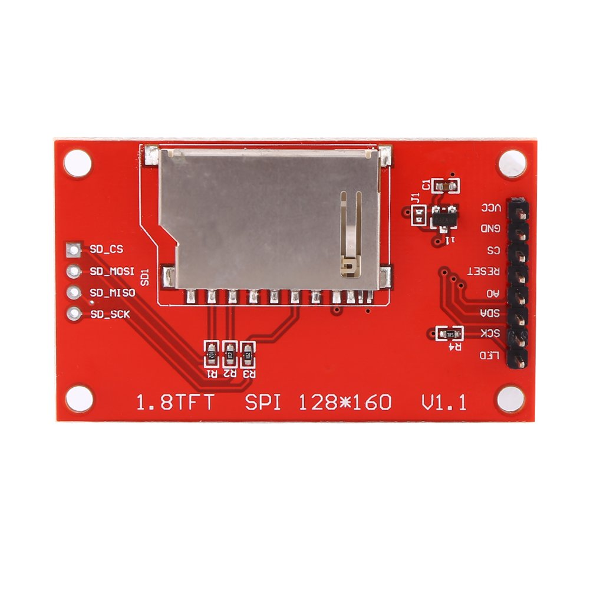
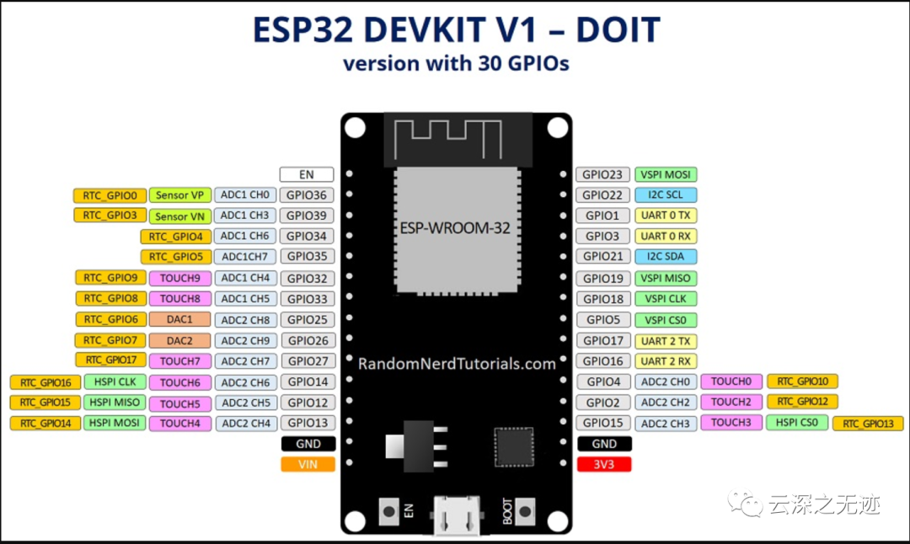
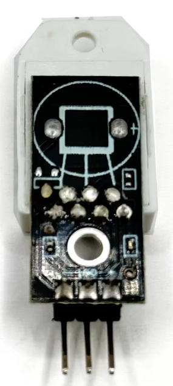

# Esp32AirQualitySensor
Soldering free!

## How to connect the ESP32 to the 1.8 inch TFT display
 

|TFT Pin|ESP32 Pin|
|-------|---------|
|VCC    |3.3V     |
|GND    |GND      |
|SCK    |GPIO 18  |
|SDA    |GPIO 23  |
|CS     |GPIO 5   |
|AO     |GPIO 2   |
|RST    |GPIO 4   |
|LED    |GPIO 15  |

## How to connect the ESP32 to the DHT22 sensor

|DHT Pin|ESP32 Pin|
|-------|---------|
|VCC    |VIN      |
|GND    |GND      |
|OUT    |GPIO 27  |

## Temperature and Humidity Sensor with TFT Display

### Dependencies
- DHT sensor library
- TFT_eSPI library

### TFT_eSPI Configuration
- Replace the file `C:\Users\YourName\Documents\Arduino\libraries\TFT_eSPIUser_Setup.h`
-  with the file `./tft_2in1/User_Setup.h`.