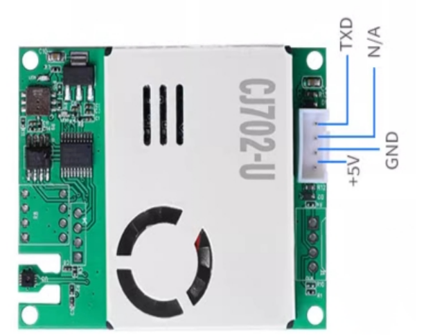

# 7 in 1 Air Quality Sensor

## How to connect the ESP32 to the 7 in 1 Air Quality Sensor

|7 in 1 Pin|ESP32 Pin|
|---------|---------|
|VCC      |VIN      |
|GND      |GND      |
|NC       |N/A      |
|TX       |GPIO 16  |
