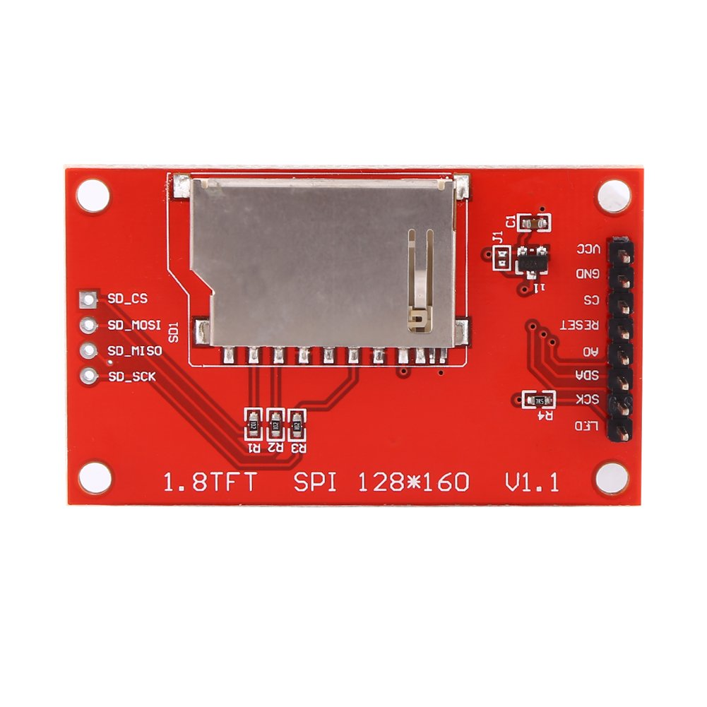

# 7 in 1 Air Quality Sensor

## How to connect the UNO to the 7 in 1 Air Quality Sensor

|7 in 1 Pin|UNO  Pin|
|---------|---------|
|VCC      |5V       |
|GND      |GND      |
|NC       |N/A      |
|TX       |D2       |

## Connect the UNO to the 1.8 inch TFT display

|TFT Pin|UNO  Pin|
|-------|---------|
|VCC    |3V3      |
|GND    |GND      |
|CS     |D1       |
|RESET  |D8       |
|AO     |D9       |
|SDA    |D11      |
|SCK    |D13      |
|LED    |D7       |